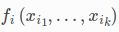
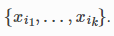
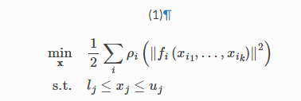
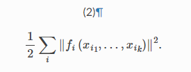

# files
- 参考资料
  - http://www.ceres-solver.org/nnls_tutorial.html#introduction
    - 官方教程(记得看安装依赖)
  - https://gitee.com/mirrors/ceres-solver
    - ceres库文件下载
  - https://blog.csdn.net/weixin_43991178/article/details/100532618
    - 官方翻译
  - https://blog.csdn.net/hjwang1/article/details/107869743
    - Ceres中的LocalParameterization
- 构建
  - ResidualBlock
    - 说明：即一个残差块
    - 
  - LossFunction
    - 说明：指前面的那个损失函数，Ceres 包括许多预定义的损失函数。为简单起见，我们描述了它们的未缩放版本。下图以图形方式说明了它们的形状。可以在 中找到更多详细信息 include/ceres/loss_function.h。
    - TrivialLoss,HuberLoss,SoftLoneLoss,柯西损失,ArctanLoss,TolerantLoss,ComposedLoss,ScaledLoss
    - 
  - CostFunction
    - 说明：除了携带CostFunctor的信息，还携带了雅可比的信息.负责计算残差和雅可比矩阵的向量
    - 相关类
      - SizedCostFunction(分析求导)
      - AutoDiffCostFunction(自动求导)
  - CostFunctor
    - 说明：应该指求二范数中的那些东西
    - 
  - ParameterBlock
    - 说明：好象是变量块
    - 
  - 稳定边界的非线性最小二乘问题
    - 
  - 无约束的非线性最小二乘问题
    - 
- 求解
  - 信任区域方法
    - 说明:可以设置这个Solver::Options::trust_region_strategy_type
    - Levenberg-Marquardt
      - 分解与迭代
    - Dogleg
  - 线搜索方法
    - 高斯牛顿法
- 相关信息注意
  - Cubic Interpolation
  - int Solver::Options::max_num_iterations
  - double Solver::Options::max_solver_time_in_seconds
  - int Solver::Options::num_threads
  - double Solver::Options::initial_trust_region_radius
  - double Solver::Options::max_trust_region_radius
  - double Solver::Options::min_trust_region_radius
  - double Solver :: Options :: gradient_tolerance
  - double Solver::Options::function_tolerance 
  - double Solver::Options::gradient_toleranc
  - double Solver::Options::parameter_tolerance
  - LinearSolverType Solver::Options::linear_solver_type
  - int Solver :: Options :: min_linear_solver_iterations
  - int Solver :: Options :: max_linear_solver_iterations
  - Solver::Summary::FullReport()
- 代码
  - options
    - max_num_iterations （int）最大迭代次数
    - linear_solver_type （#define）线性求解器
      - ceres::DENSE_QR
    - minimizer_progress_to_stdout （bool）输出报告
  - Summary
    - FullReport() 全部报告
    - BriefReport() 主要报告
  - 鲁棒核
    - CauchyLoss
    - HuberLoss
    - TrivialLoss
    - SoftLOneLoss
    - CauchyLoss
    - ArctanLoss
    - TolerantLoss
