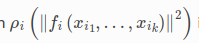
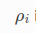

# files
- 参考资料
  - http://www.ceres-solver.org/nnls_tutorial.html#introduction
    - 官方教程(记得看安装依赖)
  - https://gitee.com/mirrors/ceres-solver
    - ceres库文件下载
  - https://blog.csdn.net/weixin_43991178/article/details/100532618
    - 官方翻译
- 定义
  - ResidualBlock
    - 说明：即一个残差块
    - 
  - ParameterBlock
    - 说明：好象是变量块
  - LossFunction
    - 说明：指前面的那个损失函数
    - 
  - CostFunction
    - 说明：除了携带CostFunctor的信息，还携带了雅可比的信息
  - CostFunctor
    - 说明：应该指求二范数中的那些东西
    - 
